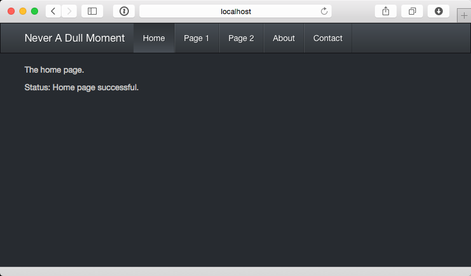

Custom ICS Play-Bootstrap
=================================

## Overview

This is a custom version of the Play Framework's default template.  It starts with activator new and 'play-java'.  The code is then modified to:

  * Conform to the ICS software engineering coding standards.

  * Illustrate how to incorporate Twitter Bootstrap 3 into Play.

  * Contain 5 basic pages (Home, Page 1, Page 2, About and Contact) w/ reactive navigation.

  * Integrate Google Fonts (unused).

  * Utilize the Bootswatch theme Slate.

## Usage

To use it, first create an empty GitHub repo and clone to your desktop.

Next, cd into your new repo and set clean-play-java2 as the upstream master:

    git remote add upstream https://github.com/ics613s15/ics-play-bootstrap.git
    git remote add upstream https://github.com/marknelsonengineer/clean-play-java2.git

Next, merge the contents of ics-play-bootstrap into your new empty repo:

    git fetch upstream
    git merge upstream/master

Now your repo will contain the clean-play-java2 repo.

Edit the build.sbt file to change the name to your new project.

## Detailed Features

ics-play-bootstrap provides the following features:

  * The navigation has its own Scala class to facilitate themed property pages without navigation.

  * Eliminate checkstyle errors.

  * Rename view files to be capitalized (i.e. Index.scala.html, not index.scala.html). This is so that the Java class
    generated by these templates are capitalized, conforming to standard Java practice.

  * Modifications to [Main.scala.html] template to load [Twitter Bootstrap 3](http://getbootstrap.com/) files using CDN sites.

  * Modifications to illustrate simple page navigation through changes to Application.java, routes, and views/* files.

  * Main.scala.html highlights the current active page through a parameter passed from the controller.
    - In case you want to have a property page without the nav.

  * main.css adjusts body padding due to the use of the fixed-top navbar.

  * Support for simple tests.

  * Fixed problems with Integration tests missing libraries and being unable to run in IntelliJ.

  * Configure .gitignore file.

  * Created Package-info files.

  

## Version information

  * Updated March 7, 2015
  * Play 2.3.8
  * Scala 2.11.1
  * Bootstrap 3.3.2
  * Activator 1.3.2

